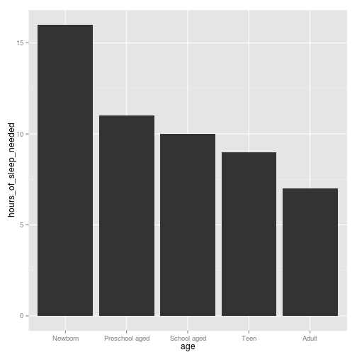

The "Do You Get Enough Sleep App"
========================================================
author: Jacob
date: 10/14/14

Sleep is important
========================================================

Sufficient sleep is increasingly being recognized as an essential aspect of chronic disease prevention and health promotion

Sleep requirements change with age
========================================================

 

The App
========================================================

* Using the do you get enough sleep app, users can enter in their age and the amount of hours of sleep they get.
* The app tells them if they are getting enough sleep.
* People who are not getting enough sleep can adjust their lifestyle to accomodate more healthy sleep habits
* This app will save lives!

The End
===============================================

# Any Questions?
